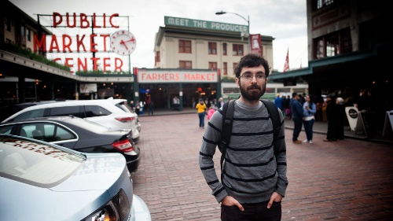

# About Me

I am a third-year undergraduate at
    [The University of Auckland](//auckland.ac.nz/), New Zealand, where I am
    studying a mix of computer science, applied maths, statistics, and biology.
I grew up in the Greater Boston area and am an avid photographer of New
    England's flora and fauna.
During high school I discovered the interdisciplinary field of computational
    biology and had the opportunity to work on projects in this area with groups
    at [Harvard](//www.oeb.harvard.edu/faculty/girguis/) and
    [MIT](//compbio.mit.edu/).
After I was awarded a scholarship by the
    [Siemens Foundation](//web.archive.org/web/20140906134706id_/http://www.siemens-foundation.org/en/competition/2013_winners.htm#3)
    in 2013, I followed my research interests to the
    [Centre for Computational Evolution](//compevol.auckland.ac.nz/) at UoA and am
    involved in a number of projects.

<a href="/cv"> CV</a> &bull;
<a href="mailto:arman@armanbilge.com">  Email</a> &bull;
<a href="//github.com/armanbilge"> GitHub</a>

---

## Colophon <a href="//github.com/armanbilge/armanbilge.github.io"></a>

This is a [Jekyll](//www.jekyllrb.com/)-generated website hosted on
    [Amazon S3](//aws.amazon.com/s3).
It uses a mildly customized [*minimal* theme](//github.com/orderedlist/minimal).
Photo galleries implement the
    [Lightbox2](//lokeshdhakar.com/projects/lightbox2/) library and are
    automatically created with a custom Liquid template.
