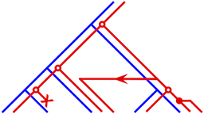

# Research

Broadly, I am interested in developing computational methods to enhance our understanding of evolutionary processes. In particular, I am eager to advance techniques for Bayesian phylogenetic inference via Markov chain Monte Carlo.

My current project focuses on systems of interdependent evolutionary trees known as *cophylogenies*. Cophylogenies are relevant to models for coevolution between symbiotic organisms and gene tree–species tree evolution. Specifically, a complete cophylogenetic history consists of a mapping of one evolutionary tree onto another and the sequence of biological events that generated this mapping (e.g., symbiotic host-switches or horizontal gene transfers).

Previous methods for cophylogenetic reconstruction have relied on maximum parsimony criteria that aim to minimise the number of events (i.e., determine the simplest explanation). However, developing a probabilistic approach to this problem would enable reconstruction of cophylogenies using Bayesian MCMC and, furthermore, their joint inference alongside other evolutionary models. The challenge is integrating out the infinite permutations of unseen events that yield the same observed history, either analytically or via an approximation.

[Project source code on GitHub.](//github.com/armanbilge/BECKY/)
